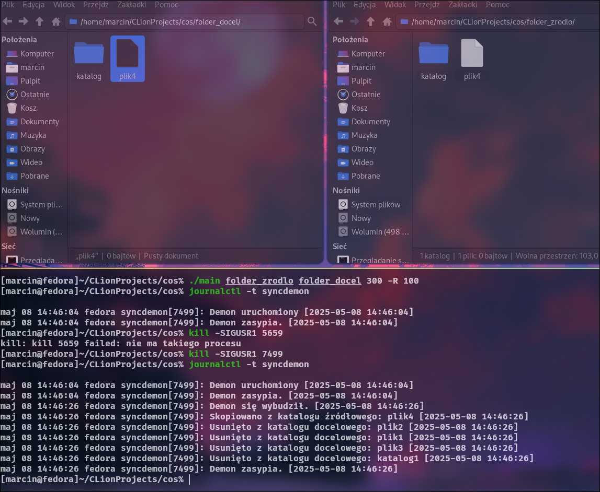

# Directory-Sync-Daemon
A background program for Linux, written in C, that automatically synchronizes two folders. At regular intervals, it checks for changes—copying new or modified files and removing those deleted from the source. It supports recursive synchronization, wake-up signals, and smart file copying based on file size.
---
## Build & Run
To build the program, compile it using:
```
gcc -o main main.c
```
Then run the daemon with:
```
./main <source_folder> <target_folder> [sleep_time_seconds] ['-R'] [size_threshold_bytes]
```
Parameters:
- <source_folder> and <target_folder> – paths to the folders to be synchronized
- [sleep_time_seconds] – (optional) sleep time between syncs, default is 300 seconds (5 minutes)
- "-R" – (optional) enables recursive directory synchronization
- [size_threshold_bytes] – (optional) file size threshold in bytes that determines the copy method; default is 104857600 (100 MB).
Files below the threshold use read/write, while larger files use mmap.

You can wake the daemon immediately by sending it the SIGUSR1 signal.
---
## Program in Action


